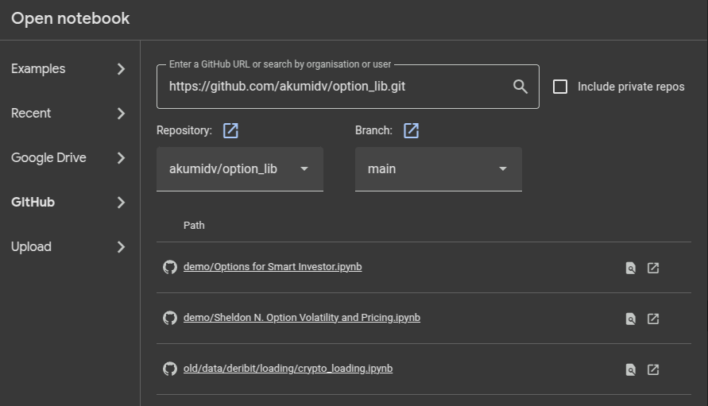

# options_assembler

Option library have goal to assist implement in code base concepts of using options.

## Env

Install all dependecies for dev and test by

```bash
poetry install --with etl,dev,test
```

## Demo

Easiest way to check haw to use option_lib is open Jupyter Notebook files in demo folder on your Google Collab.

1. Open [Google Collab](https://colab.research.google.com/)
2. Click to `File/Open` menu item.
3. On `Open notebook` popup window select GitHub and enter to an input field `Enter a Github URL or search by organization
   or user` link to current repository [option_lib](https://github.com/akumidv/option_lib.git)
4. Verify that in Repository dropdown selected `option_lib`
5. On table below will be showed list of Jupyter Notebooks
6. Select anyone, for example

7. Click to icon next to name `Open ... in new tab`
For example [Smart Investor](https://github.com/akumidv/option_lib/blob/main/demo/Options%20for%20Smart%20Investor.ipynb)

## Data

Easiest way to get data Example is load sample from shared [Google drive folder](https://drive.google.com/drive/folders/1NJNxkkUYzCfADIlPHyaZQ0jrfW9WJn2I?usp=sharing).
Save them in data folder and set path to it in `DATA_PATH` environment.

Also, you can see Jupyter Notebooks `demo` - they have bash with `gdrive` implementation how download data.

## Docs

Go to the docs folder by `cd ./docs` and run (be sure you have node.js installed on your PC)

```bash
npm install
npm run dev
```

Open link that will be shown in console

In future plans if there will be some useful code and docs to deploy with Vercel or Netlify.

Now docs are almost empty.
